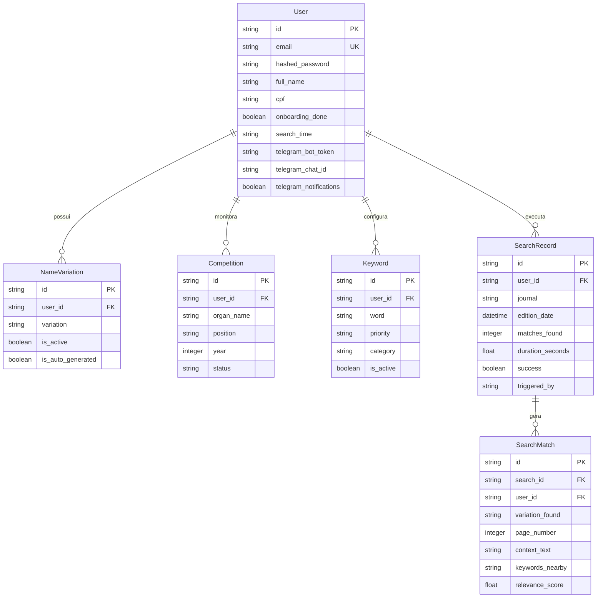

# 📜 Documentação Técnica Completa — Sistema Diário Oficial Inteligente

> **Documento Atualizado para Auditoria Técnica e Verificação pelo Claude Sonnet / Engenharia de Software.**  
> **Data de Atualização**: 24 de Julho de 2026  
> **Repositório**: [juciwaldo/diario-oficial-inteligente](https://github.com/juciwaldo/diario-oficial-inteligente)  
> **Backend Production API**: `https://diario-oficial-inteligente.onrender.com`  
> **Escopo**: Arquitetura, Modelos de Dados, Scraping DOBA/DOU, Algoritmo Regex de Quebra de Linha e Unicode, Intervalo de Datas, Autenticação JWT e Deploy no Render.

---

## 📌 1. Visão Geral do Sistema

O **Diário Oficial Inteligente** é uma plataforma SaaS desenvolvida para monitorar e auditar publicações em **Diários Oficiais** (com foco no **DOBA — Diário Oficial do Estado da Bahia** e **DOU — Diário Oficial da União**). 

O objetivo central é localizar **citações nominais e convocações de candidatos** em concursos públicos, exames, contratações REDA e atos administrativos no momento em que são publicados.

### Principais Funcionalidades:
1. **Monitoramento Automático Diário**: Agendador que executa a varredura todos os dias às 06:00 e envia alertas instantâneos via Telegram.
2. **Pesquisa Histórica por Intervalo de Datas**: Varredura em lote por períodos personalizados (7 dias, 30 dias ou até 365 dias consecutivos).
3. **Resiliência a Acentuação e Quebras de Linha**: Motor de busca com normalização Unicode NFD e regex flexível a múltiplos espaços e quebras de linha (`\n`), garantindo a localização do candidato mesmo em tabelas e colunas formatadas.
4. **Geração Automática de Variações Nominais**: Decomposição inteligente de nomes completos em possíveis combinações de citação (ex: Nome Completo, Primeiro + Último Nome, Sobrenomes compostos).

---

## 🏗️ 2. Arquitetura do Sistema

```
┌─────────────────────────────────────────────────────────────────────────┐
│                      FRONTEND (React 19 / Vite)                         │
│   - Router: TanStack Router (@tanstack/react-router)                    │
│   - UI: TailwindCSS v4 / Radix UI / Lucide React                        │
│   - API Client: Fetch centralizado com JWT em src/services/api.ts        │
└────────────────────────────────────┬────────────────────────────────────┘
                                     │
                             HTTP/HTTPS REST API (JSON)
                                     │
                                     ▼
┌─────────────────────────────────────────────────────────────────────────┐
│                    BACKEND (FastAPI / Python 3.13+)                     │
│   - Framework: FastAPI 0.111+ com Uvicorn                               │
│   - ORM: SQLAlchemy 2.0+ (AsyncIO + asyncpg / aiosqlite)                │
│   - Engine de Scraping: httpx / BeautifulSoup4 / PyMuPDF                │
│   - Scheduler: APScheduler 3.10+                                        │
└──────────┬─────────────────────────┬─────────────────────────┬──────────┘
           │                         │                         │
           ▼                         ▼                         ▼
┌──────────────────────┐  ┌──────────────────────┐  ┌──────────────────────┐
│  DOBA/DOU Scrapers   │  │   Banco de Dados     │  │   Telegram Bot API   │
│ - HTML API do DOBA   │  │ - PostgreSQL Render  │  │ - Alertas Instantâneos│
│ - DOU Portal API     │  │ - SQLAlchemy Async   │  │ - Notificação Match  │
└──────────────────────┘  └──────────────────────┘  └──────────────────────┘
```

---

## 💾 3. Modelagem do Banco de Dados (ORM SQLAlchemy)

O banco de dados é gerenciado pelo SQLAlchemy 2.0 com suporte a `asyncio`. Em produção (Render), conecta-se ao **PostgreSQL (`diario-inteligente-db`)** com o driver `asyncpg`.



---

## 🕷️ 4. Mecanismo de Scraping & Resiliência de Rede

### 4.1. Scraping Nativo do DOBA (Diário Oficial da Bahia)

A API do DOBA (`dool.egba.ba.gov.br`) é consultada via fluxo assíncrono otimizado:
1. **Consulta da Edição**: `GET /apifront/portal/edicoes/edicoes_from_data/{YYYY-MM-DD}`
2. **Índice da Edição**: `GET /html/{edicao_id}.html` (Extrai os IDs das matérias publicadas no dia).
3. **Download Concorrente**: Baixa o conteúdo HTML de até 472+ matérias simultaneamente com `asyncio.Semaphore(25)` e pool de conexões HTTP `httpx.Limits(max_keepalive_connections=50, max_connections=100)`.
4. **Resiliência a Desconexões (`_get_with_retry`)**: Qualquer instabilidade de rede ou timeout de socket é tratado com até 3 retentativas automáticas e backoff exponencial.

```python
async def _get_with_retry(self, client: httpx.AsyncClient, url: str, retries: int = 3) -> httpx.Response | None:
    for attempt in range(retries):
        try:
            res = await client.get(url)
            if res.status_code == 200:
                return res
        except Exception as ex:
            if attempt == retries - 1:
                logger.warning(f"DOBA: falha final ao acessar {url}: {ex}")
            await asyncio.sleep(0.4 * (attempt + 1))
    return None
```

---

## 🔤 5. Motor de Busca Unicode & Regex Multilinha (`SearchEngine`)

Muitas publicações oficiais sofrem quebra de coluna ou quebra de linha no HTML/PDF da imprensa oficial, dividindo o nome do candidato em duas linhas (ex: `GISÁH\n MICHELS CHEIN`).

O `SearchEngine` resolve isso combinando:
1. **Normalização Unicode NFD**: Remove acentos e converte para maiúsculas.
2. **Regex de Espaços e Quebras de Linha (`\s+`)**: Substitui espaços simples no nome pesquisado pelo padrão `\s+` que casa com espaços, tabulações e quebras de linha (`\n`, `\r`).

```python
def _find_positions(self, text: str, term: str) -> list[int]:
    import re
    import unicodedata

    def strip_accents(s: str) -> str:
        return "".join(c for c in unicodedata.normalize("NFD", s) if unicodedata.category(c) != "Mn").upper()

    norm_text = strip_accents(text)
    norm_term = strip_accents(term)

    words = norm_term.split()
    if not words:
        return []

    # Permite casar 'GISAH\n MICHELS CHEIN' quando o termo pesquisado e 'GISAH MICHELS CHEIN'
    pattern_str = r"\s+".join(re.escape(w) for w in words)
    pattern = re.compile(pattern_str)
    return [m.start() for m in pattern.finditer(norm_text)]
```

---

## 🗓️ 6. Busca por Intervalo de Datas

A rota `/api/v1/search/run` aceita `start_date` e `end_date`.

Quando um intervalo é fornecido, a função `_execute_search_range` divide o período em lotes concorrentes de 5 dias e acumula todas as citações encontradas:

```python
async def _execute_search_range(user_id, journals, start_date, end_date, custom_term=None):
    batch_size = 5
    all_matches_accumulated = []
    for i in range(0, len(date_list), batch_size):
        batch_dates = date_list[i:i+batch_size]
        tasks = [_execute_search(user_id, journals, d, custom_term=custom_term) for d in batch_dates]
        results = await asyncio.gather(*tasks, return_exceptions=True)
        for res in results:
            if isinstance(res, dict) and res.get("total_matches", 0) > 0:
                all_matches_accumulated.extend(res.get("matches", []))
    return {
        "message": f"Pesquisa concluída para o período {start_date} até {end_date}",
        "total_matches": len(all_matches_accumulated),
        "matches": all_matches_accumulated
    }
```

---

## 📡 7. Especificação das APIs REST

| Método | Endpoint | Descrição | Autenticação |
| :--- | :--- | :--- | :--- |
| `POST` | `/api/v1/auth/register` | Registro de novo usuário | Pública |
| `POST` | `/api/v1/auth/login` | Login e emissão de JWT Token | Pública |
| `GET` | `/api/v1/users/me` | Retorna o perfil do usuário logado | Bearer JWT |
| `PATCH` | `/api/v1/users/me` | Atualiza perfil e regenera variações | Bearer JWT |
| `POST` | `/api/v1/search/run` | Executa busca no DOBA/DOU (data única ou período) | Bearer JWT |
| `GET` | `/api/v1/search/history` | Retorna histórico de pesquisas executadas | Bearer JWT |
| `POST` | `/api/v1/competitions` | Cadastra novo concurso monitorado | Bearer JWT |

---

## 🚀 8. Deploy & Infraestrutura em Produção

- **Servidor Backend**: Hosted on Render (`diario-oficial-inteligente.onrender.com`).
- **Banco de Dados**: Render PostgreSQL (`diario-inteligente-db`).
- **Protocolo de Banco**: Conversão automática de `postgres://` para `postgresql+asyncpg://` em `database.py`.
- **Frontend**: Vite / React 19 compilado para Cloudflare / Vercel com conexão direta à API de Produção.

---
*Documentação mantida e atualizada pelo Antigravity AI Assistant.*
