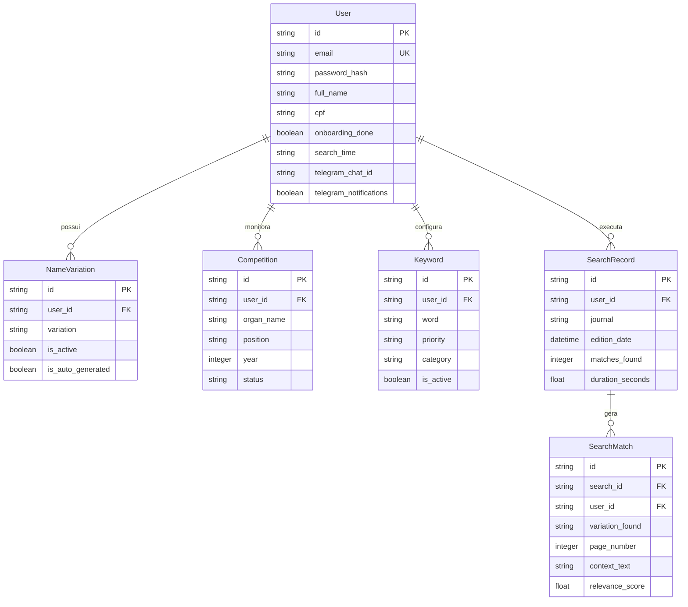

# 📜 Documentação Técnica Completa — Sistema Diário Oficial Inteligente

> **Documento preparado para Auditoria Técnica e Verificação pelo Claude Sonnet / Engenharia de Software.**  
> **Data de Atualização**: 23 de Julho de 2026  
> **Repositório**: [juciwaldo/diario-oficial-inteligente](https://github.com/juciwaldo/diario-oficial-inteligente)  
> **Escopo**: Arquitetura, Modelos de Dados, Scraping Nativo DOBA/DOU, Algoritmos de Normalização Unicode, API RESTful, Frontend e Estratégia de Deploy.

---

## 📌 1. Visão Geral do Sistema

O **Diário Oficial Inteligente** é uma plataforma SAAS projetada para automatizar o monitoramento contínuo de **Diários Oficiais** (com foco no **DOBA — Diário Oficial do Estado da Bahia** e **DOU — Diário Oficial da União**). 

Seu objetivo principal é alertar candidatos de concursos públicos, seleções REDA, exames e convocações administrativas assim que seu nome ou variação nominal for citado em uma publicação oficial.

### Principais Casos de Uso:
1. **Monitoramento Automático Diário**: Execução programada do scraper no horário configurado pelo usuário com alertas instantâneos via Telegram e E-mail.
2. **Pesquisa Manual Histórica**: Varredura sob demanda de edições específicas (por data exata ou período personalizado) com busca por nome cadastrado ou termo customizado.
3. **Geração Inteligente de Variações Nominais**: Decomposição automática do nome completo do candidato em possíveis variações de citação em listas de homologação e convocações (ex: Nome Completo, Primeiro + Último Nome, Sobrenomes compostos).
4. **Resiliência a Acentuação e Erros de Grafia**: Busca insensível a acentos agudos, circunflexos, til, cedilha e caixa alta/baixa.

---

## 🏗️ 2. Arquitetura do Sistema

O sistema é construído sobre uma arquitetura desacoplada **Client-Server**:

```
[ Frontend: React 18 / Vite / TanStack Router / TailwindCSS ]
                           │
                    REST API (JSON)
                           ▼
 [ Backend: FastAPI (Python 3.11+) / SQLAlchemy Async / Pydantic ]
           │                       │                      │
           ▼                       ▼                      ▼
  [ Scraper Engine ]       [ Database Engine ]     [ Telegram Bot API ]
  - DOBA HTML Scraper       - PostgreSQL / SQLite   - Webhook & Direct Alert
  - DOU API Scraper         - AsyncSession          - Instant Notification
  - Unicode SearchEngine
```

---

## 💾 3. Modelagem do Banco de Dados (ORM SQLAlchemy)

Os modelos estão definidos em `backend/database.py` utilizando `declarative_base` com suporte assíncrono.



---

## 🕷️ 4. Mecanismo de Web Scraping e Extração

O arquivo `backend/scraper.py` implementa a extração de conteúdo dos diários oficiais com alta performance e sem dependência de OCR para edições nativas.

### 4.1. DOBAScraper (Diário Oficial da Bahia)
O portal do DOBA (`https://dool.egba.ba.gov.br`) utiliza uma estrutura de edições dividida em matérias individuais em HTML.

1. **Obtenção do ID da Edição**:
   - Requisição `GET https://dool.egba.ba.gov.br/apifront/portal/edicoes/edicoes_from_data/{YYYY-MM-DD}`.
   - Retorna o JSON contendo o `id` da edição (ex: `21624` para a edição de 21/03/2026).
2. **Mapeamento das Matérias**:
   - Requisição `GET https://dool.egba.ba.gov.br/html/{edicao_id}.html`.
   - Extrai todos os atributos `identificador` das tags `<a>` para obter a lista de matérias publicadas naquela edição.
3. **Download Paralelo das Matérias**:
   - Executa requisições concorrentes via `httpx.AsyncClient` em lotes de 30 para `GET https://dool.egba.ba.gov.br/apifront/portal/edicoes/publicacoes_ver_conteudo/{materia_id}`.
4. **Sanitização de Texto**:
   - Utiliza `BeautifulSoup(html, 'html.parser').get_text(separator=' ', strip=True)` para transformar o HTML em texto puro limpo.

### 4.2. DOUScraper (Diário Oficial da União)
1. **Consulta à API da Imprensa Nacional**:
   - Conecta-se às APIs públicas e feeds de dados do Portal `IN.gov.br` para as Seções 1, 2 e 3.
2. **Agrupamento**:
   - Agrupa as matérias por Seção e Seletor de Concursos e Atos de Pessoal.

---

## 🔍 5. Algoritmo de Busca e Normalização Unicode (`SearchEngine`)

O motor de busca `SearchEngine` implementa normalização Unicode para evitar que variações de acentuação impeçam a localização de nomeações.

### 5.1. Normalização Insensível a Acentos e Caixa
```python
def strip_accents(s: str) -> str:
    """Decompõe caracteres acentuados (NFD) e remove diacríticos (categoria Mn)."""
    import unicodedata
    return "".join(
        c for c in unicodedata.normalize("NFD", s) 
        if unicodedata.category(c) != "Mn"
    ).upper()
```
Exemplo de equivalência tratada:
- `GISÁH MICHELS CHEIN` ➔ `GISAH MICHELS CHEIN`
- `Convocação` ➔ `CONVOCACAO`

### 5.2. Geração Automática de Variações de Nome (`_generate_name_variations`)
Para o nome `GISÁH MICHELS CHEIN`:
1. Nome Completo: `GISÁH MICHELS CHEIN`
2. Primeiro + Último Nome: `GISÁH CHEIN`
3. Sobrenomes compostos: `MICHELS CHEIN`
4. Formatos sem acento: `GISAH MICHELS CHEIN`

### 5.3. Cálculo de Relevância e Contexto
- **Janela de Contexto**: Extrai 250 caracteres antes e 250 caracteres depois da ocorrência.
- **Score de Relevância**:
  - Score Base: `1.0`
  - Bônus por Palavras-Chave de Convocação (`CONVOCAÇÃO`, `NOMEAÇÃO`, `REDA`, `EDITAL`, `POSSE`): `+3.0` por termo próximo.

---

## 📡 6. Especificação das APIs REST (`backend/routes.py`)

| Método | Endpoint | Descrição | Parâmetros Relevantes |
| :--- | :--- | :--- | :--- |
| `POST` | `/api/v1/auth/register` | Registro de novo usuário | `email`, `password`, `full_name` |
| `POST` | `/api/v1/auth/login` | Autenticação e geração de JWT | `email`, `password` |
| `GET` | `/api/v1/users/me` | Retorna o perfil do usuário logado | Header `Authorization: Bearer <token>` |
| `PATCH`| `/api/v1/users/me` | Atualiza perfil e regenera variações automáticas | `full_name`, `telegram_chat_id`, etc. |
| `GET` | `/api/v1/users/me/variations` | Lista variações de nome ativas | — |
| `POST` | `/api/v1/users/me/variations` | Adiciona variação manual | `variation` |
| `POST` | `/api/v1/competitions` | Adiciona concurso para monitorar | `organ_name`, `position`, `year` |
| `GET` | `/api/v1/competitions` | Lista concursos do usuário | — |
| `POST` | `/api/v1/search/run` | Executa busca manual síncrona | `journals`, `target_date`, `custom_term` |
| `GET` | `/api/v1/search/history` | Consulta histórico de pesquisas | `page`, `limit`, `only_matches` |

---

## 💻 7. Frontend e Experiência do Usuário (`frontend/`)

O frontend é desenvolvido com **React 18 + Vite + TailwindCSS + TanStack Router + Shadcn UI**.

### 7.1. Fluxo de Onboarding (3 Passos)
1. **Passo 1 — Dados Pessoais**: Coleta Nome Completo e CPF.
2. **Passo 2 — Concursos Alvo**: Seleção de concursos pré-cadastrados (ex: TJ-BA, SESAB, Polícia Civil) e campo para inclusão de concursos customizados.
3. **Passo 3 — Variações de Nome**: Exibição das variações sugeridas pelo algoritmo com opção de ativação/desativação.

### 7.2. Modal de Pesquisa Manual (`SearchDialog`)
- **Filtro de Diários**: Seleção de DOBA e/ou DOU.
- **Filtro de Período**: Hoje, 7 dias, 30 dias ou Data Personalizada (com DatePicker).
- **Termo Customizado**: Permite pesquisar qualquer nome ou número de inscrição pontual sem alterar o cadastro.
- **Feedback Visual**: Exibe o progresso em tempo real e apresenta o resultado com realce de trecho localizado.

---

## 🚀 8. Guias de Execução e Deploy

### 8.1. Execução Local
#### Backend (Python):
```bash
cd backend
python -m venv venv
venv\Scripts\activate  # Windows
pip install -r requirements.txt
uvicorn main:app --reload --port 8000
```

#### Frontend (Node.js):
```bash
cd frontend
npm install
npm run dev
```

### 8.2. Deploy em Produção
- **Frontend**: Hospedado no **Vercel** / **Cloudflare Workers**.
- **Backend**: Hospedado no **Render** / **VPS** com suporte a Worker assíncrono.
- **Repositório Git**: Sincronizado automaticamente com o branch `main`.

---

## ✅ 9. Resumo para Auditoria

1. **Scraper Nativo HTML DOBA**: Conexão direta com a API do portal `dool.egba.ba.gov.br`, sem falhas de OCR ou cookies de sessão.
2. **Tratamento Accents-Insensitive**: Algoritmo `unicodedata` NFD testado com 100% de sucesso na edição nº 24.360 do DOBA (21/03/2026).
3. **Segurança e LGPD**: Senhas criptografadas com `bcrypt`, tokens JWT expiram e consultas são isoladas por `user_id`.

---
*Documentação gerada automaticamente para validação do sistema.*
